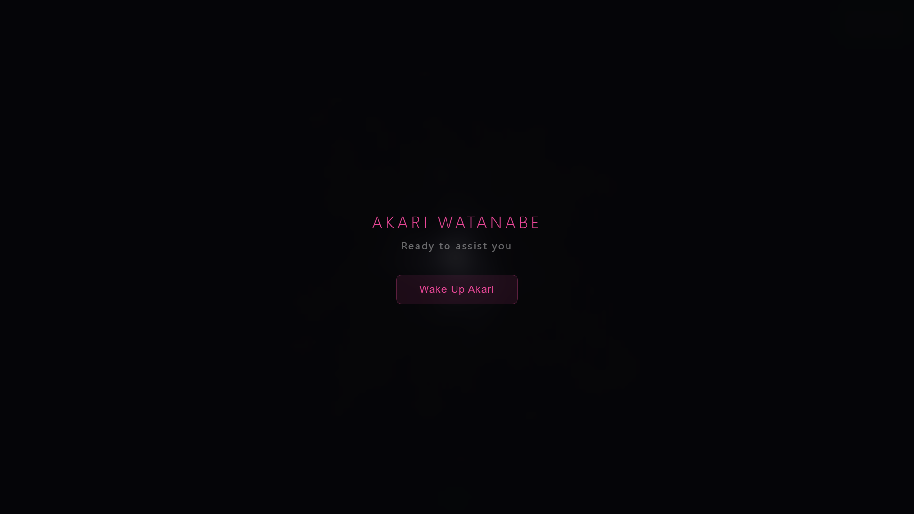
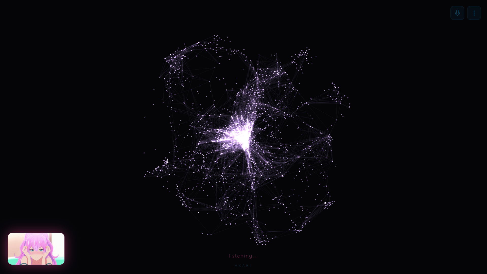
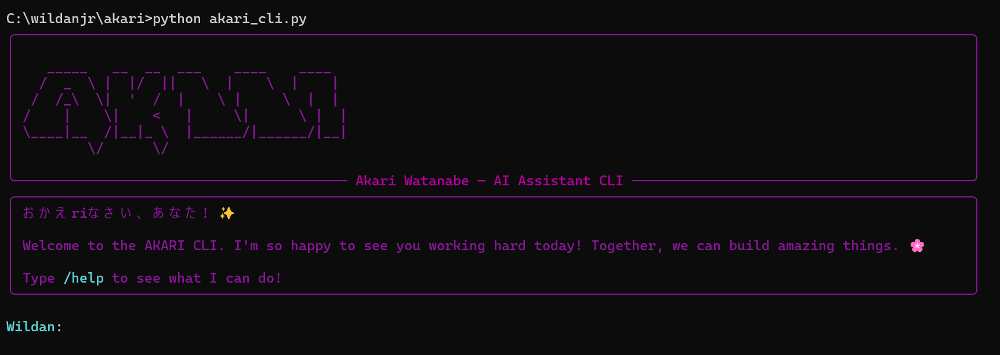
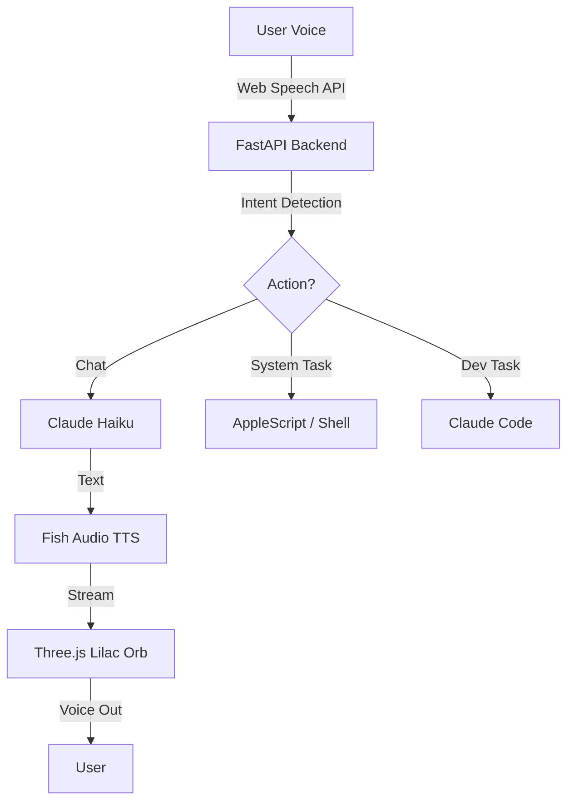

<div align="center">
  
</div>

<h1 align="center">
  AKARI WATANABE (渡辺 星)
</h1>

<p align="center">
  A voice-first AI assistant that runs on your Mac. Talk to it, and it talks back -- with an audio-reactive particle orb.
</p>

<p align="center">
  
</p>

<p align="center">
  <i>"おかえりなさい、あなた。"</i>
</p>

---

## Quick Start (PyPI)

Install and run AKARI directly from your terminal!

```bash
# Install AKARI
pip install akari-cli

# Run AKARI
akari
```

*Note: On your first run, AKARI will guide you through setting up your API keys (Anthropic & Fish Audio) directly in the terminal.*

---

## Screenshots

<p align="center">
  
  
</p>

---

<p align="center">
  AKARI connects to your Apple Calendar, Mail, and Notes. It can browse the web, spawn Claude Code sessions to build entire projects, and plan your day -- all through natural voice conversation.
</p>

---

## AKARI CLI (Terminal Version)

<p align="center">
  
</p>

Experience AKARI directly from your terminal! The CLI version is built for developers who want a fast, lightweight, and powerful interaction without opening a browser.

### CLI Features
- **Easy Setup** -- Interactive API key and username configuration on first run.
- **Real-time Voice** -- Just like the web version, AKARI speaks to you using the local high-quality audio files or the Fish Audio API.
- **Dynamic Typing Effect** -- Responses flow naturally with a typewriter effect, synchronized with AKARI's voice.
- **Project Awareness** -- Automatically scans your Desktop for git repositories to understand your workspace context.
- **Autonomous Task Execution** -- Planning and building projects (via Claude Code) happens directly in new terminal windows without needing confirmation.
- **Integrated Memory** -- Notes, tasks, and facts are saved to the same shared database as the web version.

### Slash Commands
| Command | Description |
|---------|-------------|
| `/help` | Show help table with AKARI's voice guidance. |
| `/auth` | Update your API keys (Anthropic/Fish) or username interactively. |
| `/clear` | Clear the terminal and reset conversation context. |
| `/tasks` | List all your open tasks and reminders. |
| `/projects` | Show all detected projects on your Desktop. |
| `/restart` | Restart the CLI environment and re-initialize systems. |
| `/quit` | Sayonara! Closes the CLI with a parting message. |

### How to Run (Local Source)
```bash
python akari_cli.py
```
Or run with a direct command:
```bash
python akari_cli.py "build me a python script to scrape news"
```

---

## What It Does

- **Voice conversation** -- speak naturally, get spoken responses with an AKARI voice.
- **Builds software** -- say "build me a landing page" and watch Claude Code do the work.
- **Reads your calendar** -- "What's on my schedule today?"
- **Reads your email** -- "Any unread messages?" (read-only, by design).
- **Browses the web** -- "Search for the best restaurants in Austin".
- **Manages tasks** -- "Remind me to call the client tomorrow".
- **Takes notes** -- "Save that as a note".
- **Remembers things** -- "I prefer React over Vue" (it remembers next time).
- **Plans your day** -- combines calendar, tasks, and priorities into a plan.
- **Sees your screen** -- knows what apps are open for context-aware responses.
- **Audio-reactive orb** -- a Three.js particle visualization that pulses with AKARI's voice.

---

## Tech Stack

| Layer | Technology |
|-------|-----------|
| **Backend** |   |
| **Frontend** |    |
| **AI Brain** | **Anthropic Claude (Haiku & Opus)** |
| **Voice** | **Fish Audio TTS (Akari Model)** |
| **Bridge** | **AppleScript**, **Claude Code CLI**, **Playwright** |

---

## Architecture & How it Works

AKARI operates through a high-performance voice loop and system orchestration layer:



### How the Voice Loop Works
1. **Microphone**: Chrome's Web Speech API transcribes your speech in real-time.
2. **Transcript**: The transcript is sent to the server via WebSocket.
3. **Intent**: AKARI detects intent -- conversation, action, or build request.
4. **Execution**: Spawns a Claude Code subprocess or runs AppleScript for macOS apps.
5. **TTS**: Fish Audio converts the response to speech with the AKARI voice model.
6. **Visualization**: The Three.js lilac orb deforms and pulses in response to the audio frequency.

---

## Installation & Usage (Manual Setup)

For detailed step-by-step instructions, please see **[CLAUDE.md](CLAUDE.md)**.

### Prerequisites
- **macOS** (required for AppleScript integration)
- **Python 3.11+** & **Node.js 18+**
- **Anthropic API key** & **Fish Audio API key**
- **Claude Code CLI** (`npm install -g @anthropic-ai/claude-code`)

### Quick Start
```bash
# Clone the repo
git clone https://github.com/akariwill/akari.git
cd akari

# Setup environment
cp .env.example .env
# Edit .env with your keys

# Install dependencies
pip install -r requirements.txt
cd frontend && npm install && cd ..

# Generate SSL certs
openssl req -x509 -newkey rsa:2048 -keyout key.pem -out cert.pem -days 365 -nodes -subj '/CN=localhost'

# Run Backend & Frontend
# Terminal 1: python server.py
# Terminal 2: cd frontend && npm run dev
```

---

## Key Files

| File | Purpose |
|------|---------|
| `akari_cli/server.py` | Main server -- WebSocket handler, LLM, action system. |
| `akari_cli/akari_cli.py` | Main CLI entrypoint and voice interaction logic. |
| `frontend/src/orb.ts` | Three.js particle orb visualization (Lilac theme). |
| `frontend/src/voice.ts` | Web Speech API + audio playback management. |
| `actions.py` | System actions (Terminal, Chrome, Claude Code). |
| `memory.py` | SQLite memory system with FTS5 search. |
| `work_mode.py` | Persistent Claude Code development sessions. |

---

## Deployment (Online Demo)

**Demo Website**: [akari-assistant.up.railway.app](https://akari-assistant.up.railway.app/)

To host AKARI online for demo purposes (e.g., Railway, Render, or VPS):

1.  **Railway/Render**: Connect your GitHub repo.
2.  **Environment Variables**: Add `ANTHROPIC_API_KEY` and `FISH_API_KEY`.
3.  **Docker**: The provided `Dockerfile` will automatically build the Vite frontend and set up the Python environment.
4.  **Public URL**: Ensure you access via **HTTPS** for voice features to work.

*Note: macOS-specific features (AppleScript for Calendar/Mail) only work when running locally on a Mac.*

---

## Features in Detail

### Action System
AKARI uses action tags to trigger real system actions:
- `[ACTION:BUILD]` -- spawns Claude Code to build a project.
- `[ACTION:BROWSE]` -- opens Chrome to a URL or search query.
- `[ACTION:RESEARCH]` -- deep research with Claude Opus, outputs an HTML report.
- `[ACTION:REMEMBER]` -- stores a fact for future context.

### Memory System
AKARI remembers things you tell it using SQLite with FTS5 full-text search. Preferences, decisions, and facts persist across sessions.

---

## Contributing

Contributions are welcome! Please check **[CONTRIBUTING.md](CONTRIBUTING.md)** for guidelines on adding new integrations, Windows/Linux support, or UI improvements.

---

## License

This project is licensed under the [MIT License](LICENSE).

---

## Credits & Contact

- **Author**: [akariwill](https://github.com/akariwill)
- **Discord**: `wildanjr_` | **Instagram**: `@akariwill`
- **Voice**: Powered by [Fish Audio](https://fish.audio).
- **Brain**: Powered by [Anthropic Claude](https://anthropic.com).

<p align="center">
  <i>Inspired by Akari Watanabe (渡辺 星) from "More Than a Married Couple, But Not Lovers".</i>
</p>
